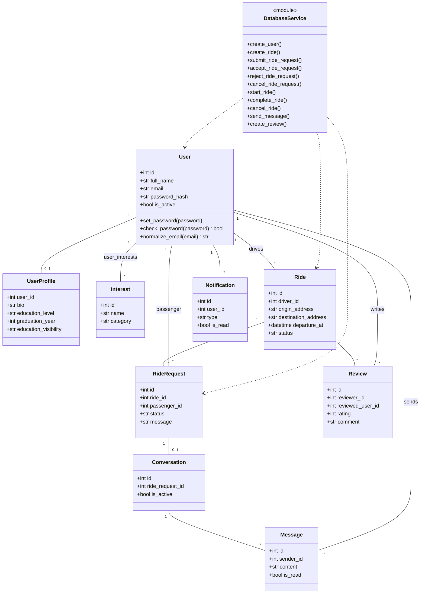

# Class diagram

The ten SQLAlchemy models and the service layer. Only the main attributes are shown; the complete column list is in
[../database-schema.md](../database-schema.md).

```mermaid
classDiagram
    class User {
        +int id
        +str full_name
        +str email
        +str password_hash
        +bool is_active
        +set_password(password)
        +check_password(password) bool
        +normalize_email(email)$ str
    }
    class UserProfile {
        +int user_id
        +str bio
        +str education_level
        +int graduation_year
        +str education_visibility
    }
    class Interest {
        +int id
        +str name
        +str category
    }
    class Ride {
        +int id
        +int driver_id
        +str origin_address
        +str destination_address
        +datetime departure_at
        +str status
    }
    class RideRequest {
        +int id
        +int ride_id
        +int passenger_id
        +str status
        +str message
    }
    class Conversation {
        +int id
        +int ride_request_id
        +bool is_active
    }
    class Message {
        +int id
        +int sender_id
        +str content
        +bool is_read
    }
    class Review {
        +int id
        +int reviewer_id
        +int reviewed_user_id
        +int rating
        +str comment
    }
    class Notification {
        +int id
        +int user_id
        +str type
        +bool is_read
    }
    class DatabaseService {
        <<module>>
        +create_user()
        +create_ride()
        +submit_ride_request()
        +accept_ride_request()
        +reject_ride_request()
        +cancel_ride_request()
        +start_ride()
        +complete_ride()
        +cancel_ride()
        +send_message()
        +create_review()
    }

    User "1" -- "0..1" UserProfile
    User "*" -- "*" Interest : user_interests
    User "1" -- "*" Ride : drives
    Ride "1" -- "*" RideRequest
    User "1" -- "*" RideRequest : passenger
    RideRequest "1" -- "0..1" Conversation
    Conversation "1" -- "*" Message
    User "1" -- "*" Message : sends
    Ride "1" -- "*" Review
    User "1" -- "*" Review : writes
    User "1" -- "*" Notification
    DatabaseService ..> User
    DatabaseService ..> Ride
    DatabaseService ..> RideRequest
```
